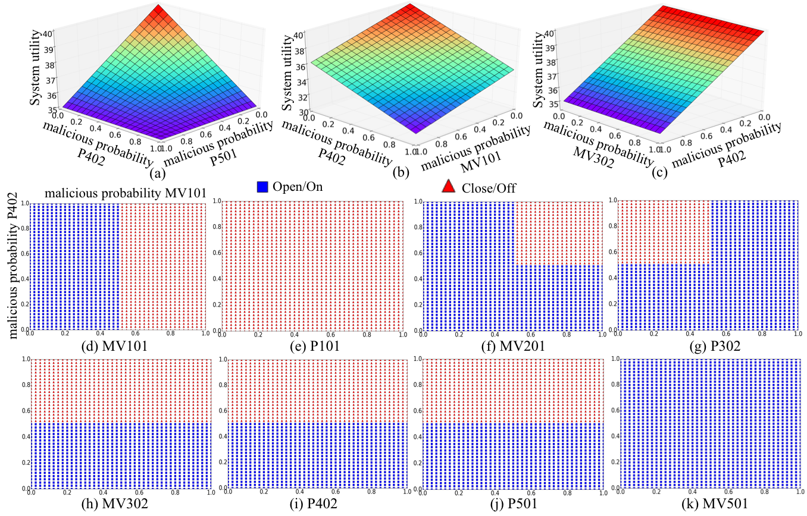

# GameForSAS
This is the public version of our paper:

Component Level Game-Based Self-Adaptation for Secure Industrial Control System

## Requirements

We use networkx to establish a component graph,
and use gambit Python API to solve the game tree.

networkx

gambit (http://www.gambit-project.org/)

pandas

numpy


## run the game generator:
```
python generate_tree.py
```

## solve the game
```
python compute_equilibrium.py
```

## results:

The system utility under three typical attacks,
and the equilibrium policies for eight components under attack (b).

Fig. (d)-(k) demonstrate the results of the policy selection of the eight components 
over two dimensions that correspond to the malicious probability ofMV101 and P402, respectively. 

Red circle points denote that the component turns OFF or Closes the valve, 
whereas black triangle points denote that it turns ON or Opens the valve.

Fig.3 (d) and (i) show the policy selection of compromised components: 
if pMV101>0.5, MV101 will Close the value, otherwise Open; 
if pP402>0.5, P402 will turn OFF, otherwise turn ON. 
Fig.3 (h) and (j) show a case where although two components are attacked, 
the policy selection of the component is only related to one compromised component. 
Fig.3 (e) and (k)show a case where attacks on MV101 and P402 will not affect P101 and MV501’s policies.
 Fig.3 (f) and (g) show a case where the policy selection of the component is related to both two compromised components. 
 Note that although attacking MV302 has no effect on the system, it still needs to change its policy with the malicious 
 probability of P402 to maximize the system utility.
